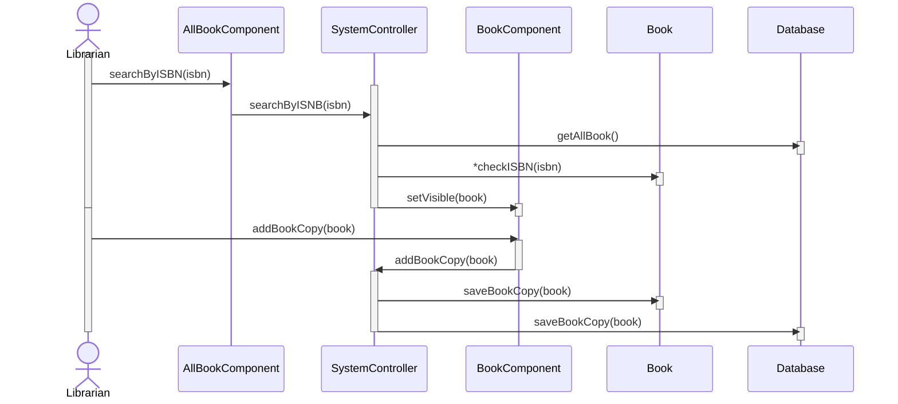

# Add a Book Copy

| Administrator            | System                                            |
|--------------------------|---------------------------------------------------|
| Enters a ISBN            | Searches book by ISBN then displays a book window |
| Clicks add a copy button | Adds a book copy                                  |

