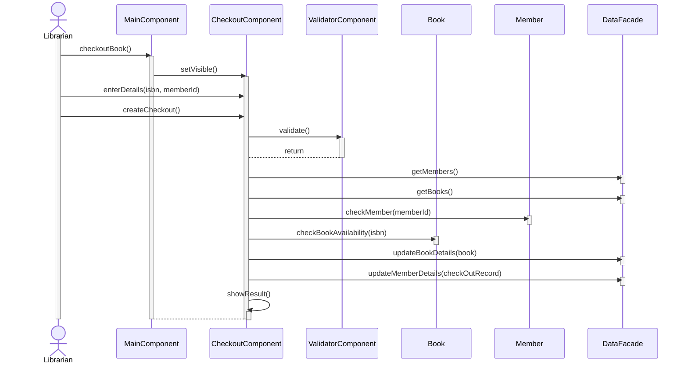

# Checkout book usecase

| User: logged in librarian | System |
| --- | --- |
| clicks checkout button | shows checkout form |
| enters book details, clicks (check) button | validate, shows correct message |
|   | creates checkout record |

