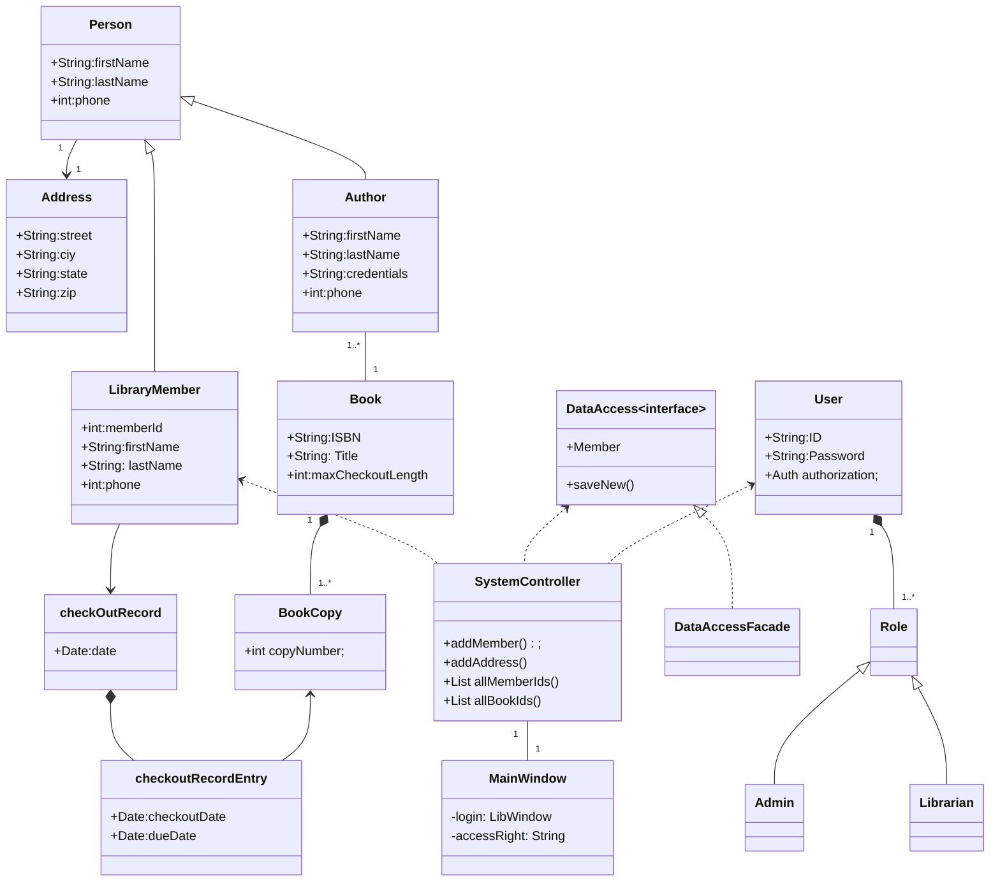

```mermaid
classDiagram
    class Address {
        +String:street
        +String:ciy
        +String:state
        +String:zip
    }
    class Person {
        +String:firstName
        +String:lastName
        +int:phone
    }
    class Author {
        +String:firstName
        +String:lastName
        +String:credentials
        +int:phone
    }
    class LibraryMember{
        +int:memberId
        +String:firstName
        +String: lastName
        +int:phone
    }
    class checkOutRecord {
        +Date:date
    }
    class checkoutRecordEntry{
        +Date:checkoutDate
        +Date:dueDate
    }
    class BookCopy{
        +int copyNumber;
    }
    class Book{
        +String:ISBN
        +String: Title
        +int:maxCheckoutLength
    }

    class SystemController{
        +addMember();
         +addAddress()
        +List<String> allMemberIds()
        +List<String> allBookIds()
    }

    class DataAccess~interface~{
        +saveNew()
        +Member
    }

    class DataAccessFacade{

    }

    class MainWindow{
       -login: LibWindow
      -accessRight: String
    }

    class User{
        +String:ID
        +String:Password
        +Auth authorization;
    }

    class Role{

    }

    class Admin{

    }
    class Librarian{

    }

Person "1" --> "1" Address
Person <|-- Author
Person <|-- LibraryMember
Role <|-- Admin
Role <|-- Librarian
LibraryMember --> checkOutRecord
User "1" *-- "1..*" Role
Book "1" *-- "1..*" BookCopy
checkOutRecord *-- checkoutRecordEntry
Author "1..*" -- "1" Book
SystemController "1" -- "1" MainWindow
LibraryMember <.. SystemController
 DataAccess<.. SystemController
 User <.. SystemController
 BookCopy <-- checkoutRecordEntry
 DataAccess <|.. DataAccessFacade


```

