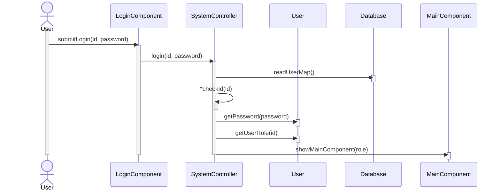

# Login

| User                                               | System                                                                                                     |
|----------------------------------------------------|------------------------------------------------------------------------------------------------------------|
| Enters a login credentials and clicks login button | Validates id and password then fetches user and based on the role shows main screen for admin or librarian |

