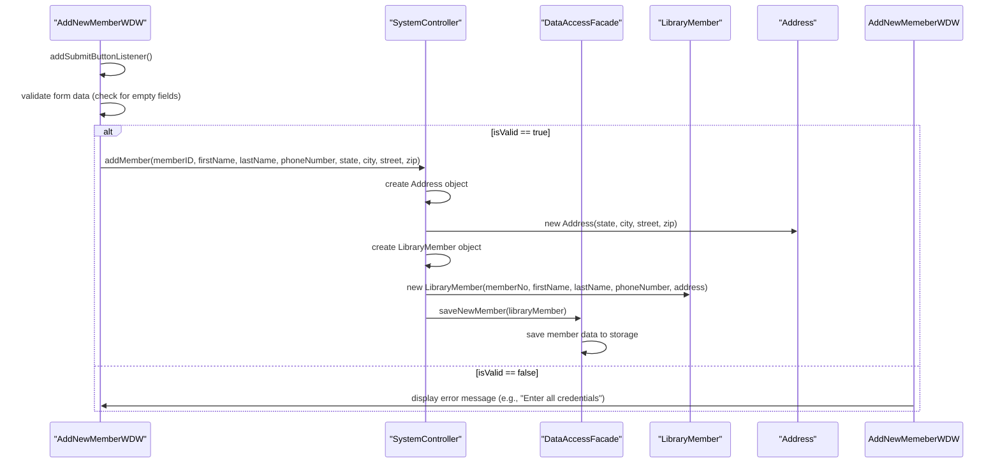

```mermaid
sequenceDiagram
    participant AddNewMemberWDW as "AddNewMemberWDW"
    participant SystemController as "SystemController"
    participant DataAccessFacade as "DataAccessFacade"
    participant LibraryMember as "LibraryMember"
    participant Address as "Address"

    AddNewMemberWDW->>AddNewMemberWDW: addSubmitButtonListener()
    AddNewMemberWDW->>AddNewMemberWDW: validate form data (check for empty fields)
    alt isValid == true
        AddNewMemberWDW->>SystemController: addMember(memberID, firstName, lastName, phoneNumber, state, city, street, zip)
        SystemController->>SystemController: create Address object
        SystemController->>Address: new Address(state, city, street, zip)
        SystemController->>SystemController: create LibraryMember object
        SystemController->>LibraryMember: new LibraryMember(memberNo, firstName, lastName, phoneNumber, address)
        SystemController->>DataAccessFacade: saveNewMember(libraryMember)
        DataAccessFacade->>DataAccessFacade: save member data to storage
    else isValid == false
        AddNewMemeberWDW->>AddNewMemberWDW: display error message (e.g., "Enter all credentials")
    end
```
